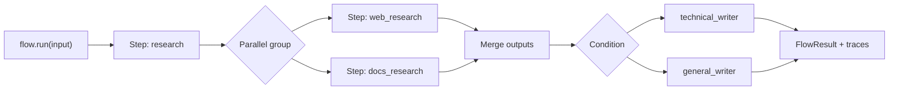

# Orchflow

[](https://pypi.org/project/orchflow/)
[](https://pypi.org/project/orchflow/)
[](https://github.com/awesome-pro/orchflow/actions/workflows/ci.yml)
[](LICENSE)

Orchflow is a lightweight Python framework for readable multi-agent pipelines.
It gives you sequential, parallel, conditional, retryable, and observable
orchestration without forcing every workflow into a heavy graph runtime.

```bash
pip install orchflow
```

```python
from orchflow import Flow, StepContext, step


@step
async def research(input: str, context: StepContext) -> str:
    return f"research about {input}"


@step
async def write(input: str, context: StepContext) -> str:
    return f"draft based on {context.previous}"


result = await Flow([research, write]).run("agent orchestration")
print(result.output)
```

## Why Orchflow Exists

Plain Python function chaining is easy to read, but it becomes fragile as soon
as a workflow needs retries, parallel work, branching, shared state, or traces.
Large graph frameworks are powerful, but they can add more abstraction than a
small agent pipeline needs.

Orchflow sits in the middle: the user writes normal Python functions, while the
framework handles orchestration mechanics that should be reliable and
inspectable.



## What It Demonstrates

Orchflow is intentionally small, but it is built like a real package:

- Async-first execution with sync-step support through worker threads
- Sequential pipelines, parallel fan-out, and conditional routing
- Retry policy at both flow and step level
- Shared run state with explicit `StepContext`
- Flat `StepTrace` records for every attempt, including failures
- Live lifecycle events with `Flow.events(...)`
- Lightweight human input gates with callback or stdin providers
- Optional LiteLLM-backed `Agent` without making LiteLLM a core dependency
- Offline test helpers under `orchflow.testing`
- Typed package metadata, CI, TestPyPI/PyPI release workflows, and tag releases

## Core Concepts

Orchflow keeps the public model deliberately small.

| Concept | Purpose |
| --- | --- |
| `Agent` | Stateless role-based LLM helper with optional LiteLLM support |
| `@step` | Decorator for a unit of workflow work |
| `StepContext` | Carries previous output, original input, metadata, and shared state |
| `Flow` | Orchestrates sequential, parallel, and conditional execution |
| `FlowResult` | Final output, traces, state, timing, and failure details |
| `FlowEvent` | Live lifecycle event emitted while a flow runs |
| `human_input` | Step helper for pausing a flow and collecting reviewer text |

## Sequential Flow

```python
from orchflow import Flow, StepContext, step


@step(name="research", retry=2)
async def research(input: str, context: StepContext) -> str:
    return f"notes about {input}"


@step(name="draft")
async def draft(input: str, context: StepContext) -> str:
    return f"article based on {context.previous}"


result = await Flow([research, draft], name="content-pipeline").run(
    "AI agent orchestration"
)

print(result.output)
print([trace.step_name for trace in result.traces])
```

Important data-flow rule: the first `input` argument is always the original
`flow.run(...)` input. Previous step output is available as `context.previous`.

## Parallel Flow

Wrap independent steps in a list to run them concurrently.

```python
flow = Flow([
    plan,
    [web_research, docs_research],
    synthesize,
])

result = await flow.run("workflow frameworks")
```

The next step receives a dictionary keyed by step name:

```python
{
    "web_research": "...",
    "docs_research": "..."
}
```

Parallel steps produce separate flat trace entries with the same
`parallel_group_id`.

## Conditional Flow

```python
from orchflow import Flow, condition

flow = Flow([
    classify,
    condition(
        when=lambda ctx: ctx.previous == "technical",
        then=technical_writer,
        otherwise=general_writer,
    ),
])
```

The predicate receives the current `StepContext`, so routing can use
`context.previous`, shared state, or run metadata.

## Human Review

Use `human_input(...)` when a pipeline needs a lightweight review point without
adding checkpointing, queues, or a separate UI.

```python
from orchflow import Flow, StepContext, condition, human_input, step


@step
async def draft(input: str, context: StepContext) -> str:
    text = f"Draft about {input}"
    context.state["draft"] = text
    return text


review = human_input(
    lambda ctx: f"Review this draft:\n{ctx.previous}\n\nDecision: ",
    name="human_review",
)


@step
async def publish(input: str, context: StepContext) -> str:
    return f"Published: {context.state['draft']}"


@step
async def revise(input: str, context: StepContext) -> str:
    return f"Revision requested: {context.previous}"


flow = Flow([
    draft,
    review,
    condition(
        when=lambda ctx: str(ctx.previous).strip().lower() == "approve",
        then=publish,
        otherwise=revise,
    ),
])
```

By default, `human_input(...)` reads from stdin. Applications and tests can pass
a sync or async `provider(prompt, context)` callback instead. The human response
is normal step output, so it is available as `context.previous` to the next step.

## Live Events

`Flow.events(...)` lets applications observe a workflow while it runs.

```python
async for event in flow.events("agent observability"):
    print(event.type, event.step_name, event.attempt)
```

Event types:

- `flow_started`
- `step_started`
- `step_completed`
- `step_failed`
- `retry_scheduled`
- `flow_completed`
- `flow_failed`

Events are orchestration lifecycle events, not token streaming. The final
`flow_completed` or `flow_failed` event carries a `FlowResult`.

## Trace Output

Every step attempt creates a flat `StepTrace`.

```python
result = await flow.run("topic")

for trace in result.traces:
    print(trace.to_dict())
```

Example shape:

```python
{
    "step_name": "draft",
    "input": "topic",
    "output": "article...",
    "error": None,
    "attempt": 1,
    "parallel_group_id": None,
    "duration_seconds": 0.42,
    "started_at": "2026-05-10T03:13:48.994932+00:00",
    "ended_at": "2026-05-10T03:13:49.414932+00:00",
    "success": True,
}
```

## Optional LLM Agent

Core Orchflow has no runtime dependencies. The public `Agent` uses LiteLLM only
when you install the optional extra:

```bash
pip install "orchflow[litellm]"
```

```python
from orchflow import Agent

writer = Agent(
    name="writer",
    role="You write concise technical explanations.",
    model="gpt-4o-mini",
)

text = await writer.run("Explain lightweight orchestration")
```

Tool-calling loops, memory, and durable agent state are intentionally outside
the current scope. Orchflow focuses on orchestration first.

## Examples

```bash
uv run python examples/basic_sequential.py
uv run python examples/parallel_steps.py
uv run python examples/conditional_flow.py
uv run python examples/live_events.py
uv run python examples/human_review.py
```

Docs:

- [Quickstart](docs/quickstart.md)
- [Concepts](docs/concepts.md)
- [API reference](docs/api-reference.md)
- [Examples](docs/examples.md)
- [Publishing](docs/publishing.md)
- [Roadmap](docs/roadmap.md)

## Development

```bash
uv sync --extra dev
uv run pytest
uv run ruff check
uv run ruff format --check
uv run pyright
uv build
```

## Release Process

TestPyPI publishing is manual through
`.github/workflows/publish-testpypi.yml`. Real PyPI publishing is tag-based
through `.github/workflows/publish-pypi.yml`.

```bash
git tag -a v0.3.0 -m "Release v0.3.0"
git push origin v0.3.0
```

The release workflow verifies that the Git tag matches `pyproject.toml`, uploads
to PyPI through trusted publishing, and creates a GitHub Release.

## Roadmap

- `0.3.x`: human input polish and docs improvements
- `0.4.0`: lightweight checkpoint/resume
- `0.5.0`: richer optional agent adapters

## Source Of Truth

Project decisions live in [AGENTS.md](AGENTS.md). Implementation follows that
document.
